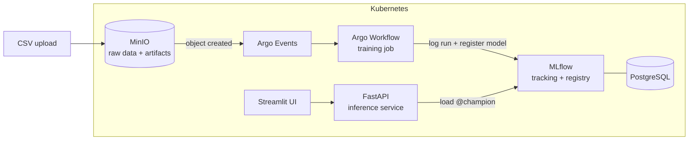

# Basket Fraud Detection

End-to-end fraud detection on retail basket data: from exploratory analysis and modeling to a fully deployed MLOps stack (training pipeline, model registry, inference API and web UI on Kubernetes).

The modeling work originates from the [BNP Paribas Personal Finance challenge](https://challengedata.ens.fr/challenges/104) hosted on the ENS Challenge Data platform: predict the probability that a financed basket is fraudulent, using only the basket content.

## The problem

Each observation describes a customer basket with up to 24 items (category, price, make, model, goods code, quantity), flattened into 147 columns. The dataset is highly imbalanced: about **1.4% fraud** (1 319 frauds out of 92 790 training baskets). The evaluation metric is **PR-AUC** (average precision), which is suited to measuring performance on the minority class.

## Approach

The full analysis lives in [notebooks/notebook.ipynb](notebooks/notebook.ipynb):

1. **Data preparation** — unpivot the wide basket format (24 × 6 columns) into a long format with one row per item, then clean categorical values (normalization, outlier remapping, missing `make`/`model` filled via a `goods_code` lookup learned on the training set).
2. **Exploratory analysis** — fraud rate by basket size, item category, price range; identification of high-risk patterns (e.g. Apple products, price zones, fulfilment charges).
3. **Feature engineering** — aggregate items back to one row per basket: price statistics (total, max, mean, std), item/product counts, and binary flags derived from the EDA.
4. **Modeling** — logistic regression and random forest baselines, then **XGBoost** with `scale_pos_weight` to handle class imbalance, evaluated with stratified k-fold cross-validation on PR-AUC.
5. **Semi-supervised experiment** — a self-training loop that iteratively moves the most confident test predictions into the training set and retrains until convergence.

## From notebook to production

The winning pipeline was then extracted into a proper Python package ([src/fraud_detection/](src/fraud_detection/)) and deployed as an event-driven MLOps stack:



- **Shared preprocessing** ([preprocessing.py](src/fraud_detection/preprocessing.py)) — the exact same Polars pipeline is used at training and inference time, with fitted artifacts (fill lookups) persisted alongside the model to avoid training/serving skew.
- **Training** ([training/](src/fraud_detection/training/)) — pulls raw CSVs from MinIO (S3 API), runs cross-validation, logs params/metrics/artifacts to MLflow and registers the model. The new version is promoted to the `@champion` alias only if its CV score beats the current champion.
- **Event-driven retraining** ([k8s/argo/](k8s/argo/)) — uploading a training file to the MinIO bucket triggers an Argo Workflow through Argo Events, so retraining requires no manual step.
- **Inference** ([inference/](src/fraud_detection/inference/)) — a FastAPI service that loads the champion model from the MLflow registry at startup:

  | Endpoint | Description |
  |---|---|
  | `POST /predict` | Score a single basket (JSON) |
  | `POST /predict/batch` | Score a raw CSV file |
  | `POST /reload` | Hot-reload the champion model |
  | `GET /health` | Service and model status |

- **UI** ([ui/](src/fraud_detection/ui/)) — a Streamlit app to build a basket by hand or upload a CSV, with filtering and export of scored results.
- **CI/CD** ([.github/workflows/](.github/workflows/)) — three GitHub Actions workflows build and push the training, inference and UI images to GHCR on every change to the relevant paths.

## Repository layout

```
├── notebooks/              # Challenge solution: EDA, features, models, submissions
├── src/fraud_detection/
│   ├── preprocessing.py    # Shared feature pipeline (Polars)
│   ├── schema.py           # Column schema and feature list
│   ├── contract.py         # Input data validation
│   ├── training/           # Training entrypoint, MLflow logging, S3 IO
│   ├── inference/          # FastAPI service, champion model loader
│   └── ui/                 # Streamlit app
├── k8s/                    # Namespace, MinIO, PostgreSQL, MLflow, Argo, API, UI
├── Dockerfile.training     # One image per component, built with uv
├── Dockerfile.inference
├── Dockerfile.ui
└── .github/workflows/      # Image build pipelines (GHCR)
```

## Getting started

Requires Python 3.11+ and [uv](https://docs.astral.sh/uv/).

```bash
# Install with the extras you need
uv sync --extra training --extra inference --extra ui

# Run the API locally (expects a reachable MLflow tracking server)
uvicorn fraud_detection.inference.api:app --reload

# Run the UI (expects the API at $API_URL, default http://fraud-inference:8000)
streamlit run src/fraud_detection/ui/app.py
```

The notebook has its own lightweight requirements: [notebooks/requirements.txt](notebooks/requirements.txt). The challenge datasets are in [notebooks/data/](notebooks/data/).

### Kubernetes deployment

Manifests are in [k8s/](k8s/) (tested on a lightweight local cluster):

```bash
kubectl apply -f k8s/namespace.yml
kubectl apply -f k8s/minio/ -f k8s/postgres/ -f k8s/mlflow/
kubectl apply -f k8s/argo/          # requires Argo Workflows + Argo Events installed
kubectl apply -f k8s/inference/ -f k8s/ui/
```

Upload `X_train.csv` then `Y_train.csv` to the `fraud-raw-data` bucket: the training workflow fires automatically, and once a champion is registered, `POST /reload` (or a pod restart) makes the API serve it.

## License

[MIT](LICENSE)
